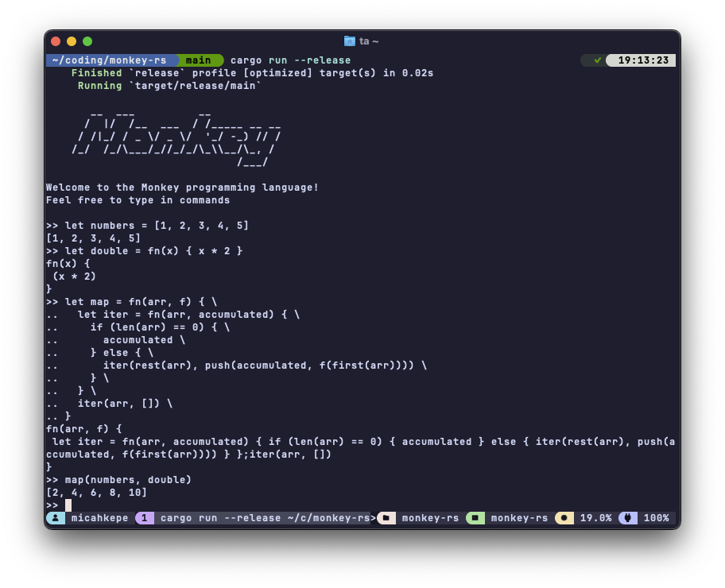

# monkey-rs 🦀

[](https://github.com/micahkepe/monkey-rs/actions)

<div align="center">
    
</div>

A Rust implementation of the [Monkey](https://monkeylang.org/) programming
language from Thorsten Ball's [Writing An Interpreter In Go](https://interpreterbook.com/).

> _"But why the name? Why is it called “Monkey”? Well, because monkeys are
> magnificent, elegant, fascinating and funny creatures. Exactly like our
> interpreter"_ — Thorsten Ball

<div align="center">
    
</div>

## Quick Start

### Usage:

```
Runs and evaluates the Monkey source file (`*.monkey`), if provided, else starts a Monkey REPL session to run Monkey code

Usage: monkey [FILE]

Arguments:
  [FILE]  Path to a Monkey source file to execute (must have `.monkey` extension)

Options:
  -h, --help  Print help
```

### REPL

To run the Monkey REPL:

```
cargo run --release
```

To run tests:

```
cargo test
```

### Running a `.monkey` File

To run a Monkey source file:

```
cargo run --release -- path/to/file.monkey
```

> [!NOTE]
> The file must have a `.monkey` extension, or the program will exit with an error
> message. Only the last evaluated statement's output is printed to
> `stdout` (alongside any `puts(...)` statements).

## [Documentation](https://micahkepe.com/monkey-rs/)

Comprehensive documentation is available as a [mdBook](https://github.com/rust-lang/mdBook).

You can view the live site [here](https://micahkepe.com/monkey-rs/)

To build and view the documentation locally:

```bash
cd docs
mdbook serve
```

The documentation covers:

- Language syntax and features
- Data types and operations
- Built-in functions
- REPL usage
- Functional programming patterns

## Contributing

Contributions are welcome! Please open an issue or pull request on GitHub for
bug reports, feature requests, or improvements. Ensure code follows Rust
conventions and includes tests.

## License

This repository is licensed under the MIT License. See [LICENSE](./LICENSE) for
more details.
