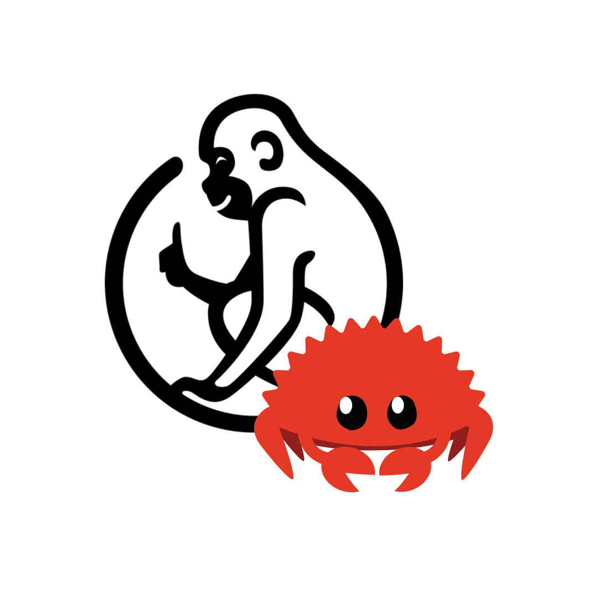

# monkey-rs 🦀

    

A Rust implementation of the [Monkey](https://monkeylang.org/) programming
language from Thorsten Ball's
[Writing An Interpreter In Go](https://interpreterbook.com/).

> _"But why the name? Why is it called “Monkey”? Well, because monkeys are
> magnificent, elegant, fascinating and funny creatures. Exactly like our
> interpreter"_ — Thorsten Ball

## TODOs

- [x] Lexer
- [ ] Parser
- [ ] Evaluation
- [ ] Extending the Interpreter
- [ ] Macro System ("The Lost Chapter")
